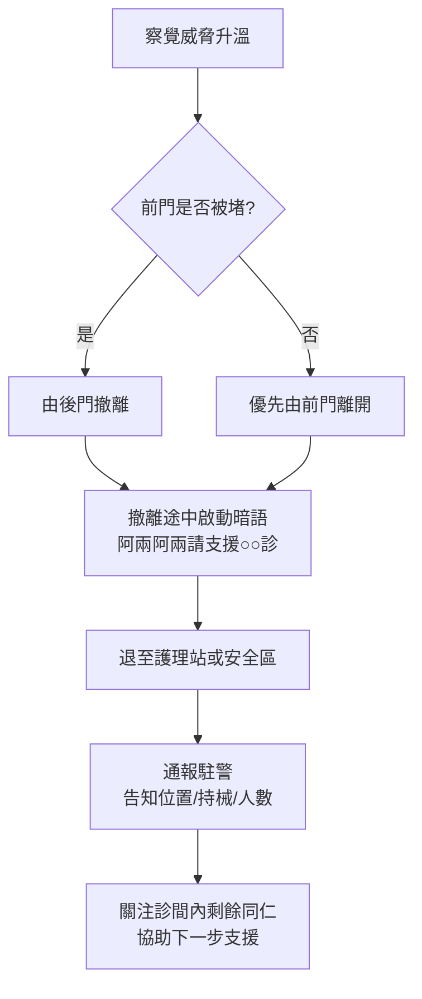
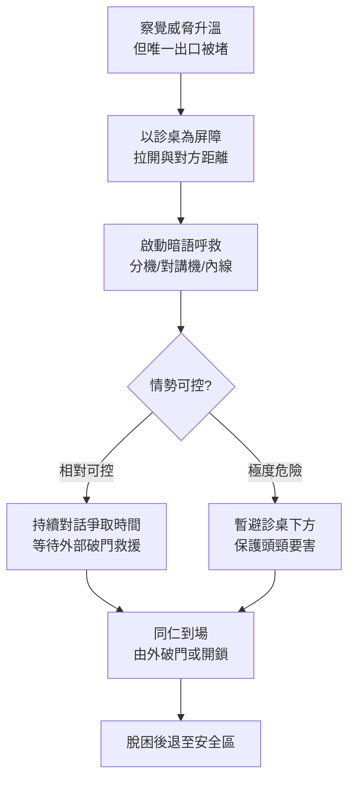

# M03 環境察覺與自我調控

> **模組目標**：培養門診護理師對環境風險的敏銳察覺力，掌握安全站位原則，學會辨識與調控自身壓力反應，並了解診間安全改善方向。

---

## 一、門診環境風險掃描

CIT 接觸前評估中的「居安思危」強調：在接觸激躁者之前，必須先評估環境。門診環境與急診、病房不同，有其獨特的風險因子。

### 1.1 診間類型與風險差異

| 診間設計 | 風險特點 | 安全建議 |
|--------|--------|--------|
| **單門診間** | 唯一出入口可能被激躁者阻擋，護理師無退路 | 座位安排應讓醫護靠近門口側；門不上鎖 |
| **雙門診間** | 有備用逃生路線，風險較低 | 確保後門隨時可開啟，不被雜物堵住 |
| **開放式護理站** | 櫃檯有物理隔離，但患者可繞過 | 確認櫃檯有足夠高度，重要物品不外露 |
| **獨立檢查室** | 空間狹小、隔音、外部不易察覺異狀 | 避免單獨與高風險患者進入；門保持微開 |

> **實務重點**：進入任何診間前，養成「掃描出口」的習慣。問自己：「如果現在需要離開，我的路線是什麼？」

### 1.2 候診區風險因子

候診區是門診暴力事件最常發生的地點，需要注意以下風險因子：

- **擁擠程度**：人多時情緒容易相互感染，也增加衝突機率
- **視線死角**：柱子、隔板、轉角處可能遮蔽護理師的觀察視線
- **出口位置**：確認候診區的緊急逃生動線，確保通道暢通
- **等候資訊**：叫號系統是否正常運作、等候時間是否可見

### 1.3 潛在武器辨識

在門診環境中，許多日常物品在激躁者手中可能成為武器：

| 物品類別 | 常見項目 | 管控建議 |
|--------|--------|--------|
| 醫療器材 | 點滴架、剪刀、針具、血壓計支架 | 尖銳物品收納於上鎖抽屜，不外露放置 |
| 辦公用品 | 釘書機、剪刀、文鎮、螢幕 | 重物固定或收納，桌面保持簡潔 |
| 患者隨身物品 | 拐杖、雨傘、水壺、背包 | 觀察患者手中物品，評估風險 |
| 環境設施 | 椅子、垃圾桶、花瓶、滅火器 | 固定式座椅優於可移動座椅 |

> **臨床提醒**：環境風險掃描不是偶爾為之的動作，而是應養成的**日常習慣**。每天上班時花 30 秒掃視工作環境，確認逃生路線暢通、尖銳物品已收納。

---

## 二、安全站位原則

當需要面對情緒激躁的患者或家屬時，站位是保護自身安全的第一道防線。

### 2.1 四大安全站位原則

| 原則 | 具體做法 | 為什麼重要 |
|------|--------|---------|
| **保持 1--2 公尺安全距離** | 約一個手臂加一步的距離 | 給予對方空間感，也讓自己有反應時間 |
| **側身 45 度站位** | 身體微側，非正面面對 | 降低威脅感，減少被正面攻擊的面積 |
| **保持出口暢通** | 站在靠近門口的位置 | 確保隨時可以安全撤離 |
| **不被逼至角落** | 避免退到牆角或死角 | 一旦被困在角落，將失去所有退路 |

> **錯誤示範**：
> - 正面貼近以展現誠意 -- 這會讓對方感到被侵犯，增加攻擊風險
> - 背對出口表示無威脅 -- 這會讓自己失去逃生路線
> - 站在病人與出口之間 -- 這會讓對方感到被困住而更加激動

### 2.2 站位實務要領

- **接近時**：從患者的側面緩慢接近，不要從正面或背後
- **對話時**：維持適當距離，雙手自然放在身體前方（非交叉抱胸）
- **移動時**：若需退後，腳步平穩後移，不要轉身背對患者
- **多人時**：指定一人主責溝通，其他人在旁待命但不要形成包圍態勢

### 2.3 緊急求救設備的使用

當情勢升溫至即將發生肢體衝突時，及時求救是保護自身安全的關鍵。

**何時按下緊急求救鈴？**

- 患者或家屬出現**立即性的肢體威脅**（揮拳、持物攻擊）
- 患者**阻擋出口**，使你無法安全撤離
- 發現患者**持有或疑似持有武器**
- 情勢已超出個人可控範圍，且口頭呼救可能激化對方

**無聲警報 vs. 口頭呼救：**

| 方式 | 優點 | 缺點 |
|------|------|------|
| **無聲警報**（panic button） | 不刺激激躁者、不升高對峙氛圍、支援人員可預先準備 | 不是所有診間都有配置、對方可能不知道已有支援即將到達 |
| **口頭呼救** | 任何場所都可執行、周遭人員立即知悉、可能嚇阻攻擊者 | 可能進一步激怒激躁者、在隔音良好的診間效果有限 |

> **台大門診現況**：並非所有台大醫院診間都配備緊急按鈕。在未設置 panic button 的診間，建議與同仁**事先約定暗號或手勢**（例如：特定的對講機代碼、用內線電話說出約定關鍵詞），確保在緊急時能夠無聲通報。

### 2.4 低刺激通報：暗語系統

根據 4/9 前測會議（精神部）討論：緊急壓扣鈴於診間內會發出明顯聲響，反而可能刺激已激躁的病人。因此，除了硬體警報外，**口語暗語系統**是門診最實用的低刺激通報機制。

**為什麼需要暗語？**

- **硬體警報聲響激化風險**：傳統緊急鈴聲響會被激躁者解讀為「你們在叫警察抓我」，立即升高對峙
- **口頭呼救同樣有刺激風險**：直接喊「保全！」「駐警！」可能觸發攻擊
- **暗語兼顧通報效率與低刺激**：聽起來像日常對話，但同仁能立刻識別

**建議暗語格式**（4/7 前測會議內科部結論）：

> 「阿兩阿兩請支援○○診」

- 「阿兩阿兩」作為統一啟動詞，全院一致
- ○○診明確告知地點，讓駐警能直接前往
- 語氣自然，不驚動其他候診病友

**傳統呼叫 vs 暗語 對照：**

| 面向 | 傳統呼叫 | 暗語系統 |
|------|---------|---------|
| 激化風險 | 高（「保全」「駐警」直接刺激） | 低（聽似日常對話） |
| 同仁識別 | 清楚但人人皆知 | 同仁受訓後易識別 |
| 病人識別 | 立即知道要叫警察 | 不會立即察覺 |
| 駐警預警 | 已經升級才通報 | 可提前抵達準備 |
| 候診民眾 | 可能引發恐慌 | 幾乎無感知 |

**配套措施：**

1. **各診間事先約定**：每診間在當班交班時確認暗語啟動流程
2. **每月演練 1 次**：確保新進同仁熟悉、老同仁不遺忘
3. **多管道備援**：分機電話、對講機、內線電話皆可啟動
4. **明確地點標示**：暗語必包含診間編號，避免駐警誤入

> **實務提醒**：暗語系統只有在「全院統一+定期演練」的前提下才有效。單一診間自創暗語、或長期不演練，遇到真實事件時容易失靈。建議納入每月門診例行訓練。

### 2.5 被困住時怎麼辦

萬一激躁者阻擋出口或你被逼入角落，以下是保護自身安全的應對原則：

1. **保持冷靜，不表現出恐慌** -- 恐慌的表情與動作可能被激躁者解讀為挑釁或觸發其進一步攻擊
2. **利用家具建立屏障** -- 將桌子、椅子、診療車等物品置於自己與對方之間，爭取空間與時間
3. **持續對話，爭取時間** -- 即使對方不回應，也要持續用平穩的語調說話（「我想幫你解決問題」「我們可以一起想辦法」），讓支援人員有時間到達
4. **大聲呼救** -- 如果無法使用無聲警報，用力呼喊以引起注意（「需要幫忙！」「請叫駐警！」）
5. **掙脫時朝出口方向移動** -- 如果被抓住或推擠，掙脫的方向應**朝向出口**，而非遠離出口。背向出口掙脫只會讓自己更深入死角

> **核心觀念**：被困住時的首要目標不是制伏對方，而是**創造脫困的機會**。任何能讓你接近出口的動作都是正確的選擇。

### 2.6 單門／雙門診間標準撤離流程

根據 4/7、4/9 前測會議共同發現：目前各診間缺乏標準化撤離動線。以下依診間類型提供建議流程：

**雙門診間撤離流程：**

**單門診間撤離流程：**

**關鍵原則：**

1. **出口永遠暢通**：日常即檢查，勿讓雜物堆積阻礙逃生
2. **備用鑰匙分散保管**：護理站、安衞室、駐警隊各有一把
3. **診桌下方為最後避難點**（4/9 會議建議）：空間雖小但可短暫阻擋攻擊
4. **撤離時啟動暗語**：一邊移動、一邊通報，不等脫困後才通報
5. **預先演練動線**：每季至少演練一次，確保肌肉記憶

> **設計建議**：新建或改建門診空間，優先採用雙門設計；既有單門診間應評估是否可增設後門或緊急逃生通道。

### 2.7 反鎖門的應對

4/9 前測會議（精神部）特別點出：病人反鎖門後，駐警無法即時進入，僅能破門，應變彈性嚴重不足。以下提供完整應對策略：

**預防優先：門窗不反鎖原則**

- **日常規範**（4/9 會議建議）：門診診間的門原則上**不反鎖**，避免單人被困或限制救援
- **安全鎖機制**：若必須關門（如進行身體診察），使用可由外部以鑰匙開啟的安全鎖，而非單向反鎖
- **高風險患者**：事先辨識（參考「眼耳鼻舌身意」六感評估）並避免進入僅可內鎖的空間

**備用鑰匙分散保管：**

| 保管單位 | 用途 | 取用時機 |
|--------|------|--------|
| **護理站** | 同診區快速救援 | 同事察覺異狀，第一時間開門 |
| **安衞室** | 跨診區支援 | 護理站鑰匙不在現場時 |
| **駐警隊（Master Key）** | 最終解鎖手段 | 前兩者皆無法取得時 |

**駐警到場前資訊傳遞（必備三項）：**

暗語通報時，**必須告知駐警以下資訊**，使其能預先準備裝備：

1. **是否持械**：影響駐警是否攜帶盾牌、束帶
2. **是否反鎖**：決定是否需攜帶 Master Key 或破門裝備
3. **現場人數**：患者側、醫護側、候診民眾各多少人

> **通報範例**（整合 Pre-SBAR 格式）：
> 「內科 13 診，緊急，患者持水果刀，門已反鎖，診間內醫護 2 人、病人 1 人，候診區約 5 人需疏散。」

**破門為最後手段：**

- **優先順序**：語言降階 → Master Key 開鎖 → 專業破門工具 → 徒手破門
- **破門決策權**：由當班 leader 或駐警主管下達，非單一同仁可決定
- **破門後風險**：聲響、碎片、突然光線變化都可能刺激患者，破門同時必須同步啟動降階話術

> **重要提醒**：反鎖門的本質是「資訊斷絕」——外部看不到內部、內部無法即時脫困。因此**通報資訊越完整，越能縮短救援時間**。暗語+Pre-SBAR 的組合是降低反鎖事件傷害的核心。

---

## 三、自我情緒調控

面對暴力威脅時，人體會自然啟動「戰或逃」反應（fight-or-flight response）。護理師必須學會辨識自身的壓力反應，才能在高壓情境下維持專業判斷力。

### 3.1 辨識自身壓力反應

| 反應類別 | 常見表現 | 注意事項 |
|--------|--------|--------|
| **生理反應** | 心跳加速、手抖、冒汗、呼吸急促、口乾 | 這些是正常的生理反應，不代表你不專業 |
| **情緒反應** | 恐懼、憤怒、焦慮、無力感 | 允許自己有情緒，但不讓情緒主導行動 |
| **認知反應** | 思緒混亂、注意力狹窄、難以做決定 | 此時應回到標準流程，依照 SOP 行動 |
| **行為反應** | 聲音變高、語速加快、身體僵硬 | 對方會感受到你的緊張，可能加劇情勢 |

> **CIT 核心理念**：若您感到危險或害怕，**相信自己的直覺，不要冒然動作**。恐懼是身體的保護機制，告訴你需要更多支援。

### 3.2 即時調控技巧

在面對激躁情境的當下，可以運用以下技巧穩定自己：

**深呼吸技巧（Box Breathing）**

1. 吸氣 4 秒（鼻子吸）
2. 屏住 4 秒
3. 吐氣 4 秒（嘴巴吐）
4. 屏住 4 秒
5. 重複 2--3 次

**自我對話**

- 「我可以處理這個情況，我有受過訓練。」
- 「我不是一個人，團隊就在旁邊。」
- 「先確保安全，其他的之後再處理。」

**專業距離維持**

- 不要把對方的言語攻擊當作針對個人
- 提醒自己：對方攻擊的是「系統/情境」，不是「你」
- 使用第三人稱思考：「這位患者目前在暴力曲線的升溫期，我應該...」

### 3.3 事件後的自我照顧

暴力事件結束後的心理照顧同樣重要：

- **當天**：與同事分享經歷、接受情緒關懷，不壓抑感受
- **短期**：若出現反覆回想、失眠、過度警覺等反應，屬正常的壓力反應
- **必要時**：利用院內心理諮詢服務或衛生局「安心服務」進行復原關懷
- **團隊**：參與事件檢討會議，從團隊角度學習，而非自我歸咎

> **重要提醒**：遭遇暴力事件後感到不安、害怕、甚至不想上班，這些都是**正常反應**。尋求協助不是軟弱的表現，而是專業的自我照顧。

---

## 四、門診診間安全改善建議

根據 CIT 環境評估原則與門診實務經驗，以下是診間安全的具體改善方向：

| 改善面向 | 具體建議 | 優先順序 |
|--------|--------|:------:|
| **逃生路線** | 診間門口不堆放雜物、後門隨時可開啟 | 高 |
| **求救機制** | 設置隱蔽式緊急按鈕或暗號系統 | 高 |
| **物品管理** | 尖銳物品收納上鎖、桌面保持簡潔 | 高 |
| **座位配置** | 醫護座位靠近門口側 | 中 |
| **候診管理** | 即時看診進度顯示、主動告知等候時間 | 中 |
| **監視設備** | 候診區與診間走道設置監視器 | 中 |
| **空間設計** | 新建或改建時優先採用雙門設計 | 低（長期） |
| **教育訓練** | 定期辦理 CIT 工作坊與情境演練 | 持續 |

---

## 五、環境察覺的日常練習

環境察覺不是緊急時才啟動的能力，而是可以透過日常練習培養的習慣：

1. **每日上班時**：花 30 秒掃視工作區域，確認出口、尖銳物品、求救設備
2. **接觸患者前**：快速評估對方的「眼耳鼻舌身意」六感指標（參見 M01）
3. **進入診間時**：確認自己與門的相對位置
4. **發現異狀時**：信任直覺，先通知團隊再評估

> **養成口訣**：「出口在哪裡？我的退路是什麼？環境中有沒有風險物品？」-- 每天問自己三次，直到成為自動化反應。

---

## 本模組重點回顧

1. 環境風險掃描是日常習慣，不是緊急時才做的事
2. 安全站位四原則：**1--2 公尺距離、側身 45 度、保持出口暢通、不被逼至角落**
3. 熟悉緊急求救設備的使用時機，未配備 panic button 時應有替代暗號方案
4. 被困住時：利用家具屏障、持續對話、**朝出口方向掙脫**
5. 辨識自身壓力反應是維持專業判斷力的前提
6. **自身安全永遠是最高優先**，尋求協助不是軟弱的表現

---

*參考資料：TW-CIT 教材（2022）「接觸前評估」，林皓陽醫師製作；台大醫院門診暴力事件滋擾流程（門診作業規範）；門診暴力事件預防情境知識性考題。*

---
## 延伸學習

- **← [M02 Agitation 急性處置](/content/M02)**：了解躁動評估流程
- **→ [M04 言語降階](/content/M04)**：環境安全後，開始言語降階
