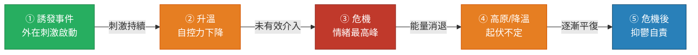
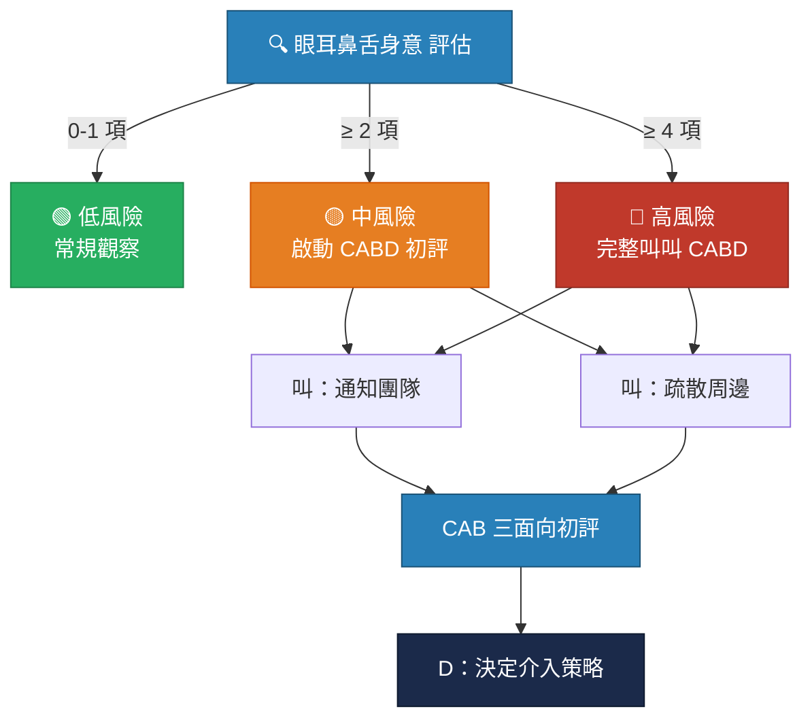
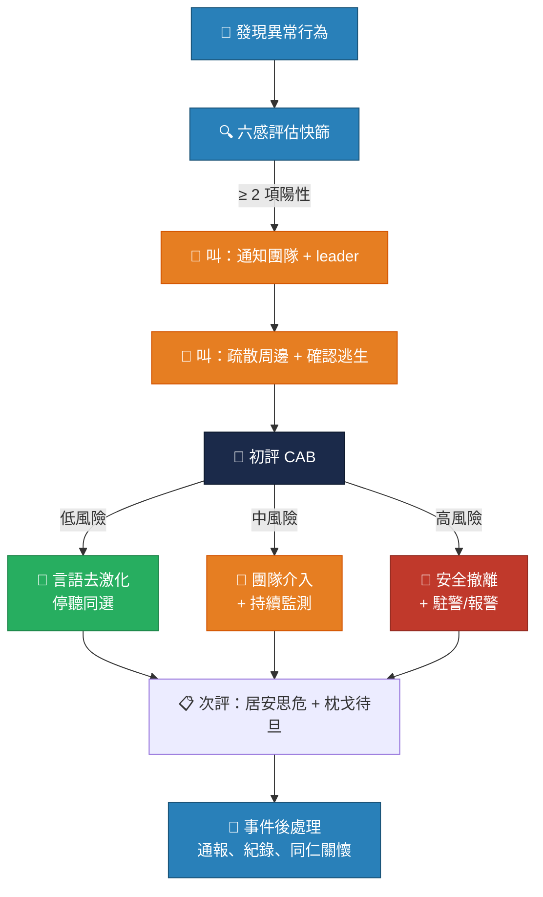

  
  
掃描分享 cit.henry780930.com

# 暴力曲線與風險辨識

### CIT 危機處理介入訓練工作坊

**林皓陽醫師** ｜ 臺大醫院急診醫學部

115 年 4 月 20 日 ｜ 08:10--09:00（50 min）

---

## 學習目標

  <strong>🎯 目標一</strong>：認識暴力曲線五階段模型，掌握各階段的行為指標與介入策略

  <strong>🔍 目標二</strong>：學會使用「眼耳鼻舌身意」六感評估法辨識暴力前兆，判斷啟動 CABD 的時機

  <strong>🛡️ 目標三</strong>：運用「叫叫 CABD」架構，對門診激躁事件進行系統化初評與處置

---

## 暴力不是突然發生的

📈

「暴力是一條曲線，不是一個開關」

暴力的發生常有徵兆 ── 學會辨識早期訊號，就能在事態升級前及時介入

---

## 暴力曲線五階段

  🟢 綠色區域：解情、解困
  🟡 黃色區域：轉移與降溫
  🔴 紅色區域：緊急介入

---
layout: two-cols
---

## 各階段門診表現

### 階段一：誘發事件 🟢

反覆詢問、頻繁看時間 
語氣略帶不耐、坐姿不安

### 階段二：升溫 🟡

音量提高、開始指責 
站起靠近櫃檯、手勢變大 
使用負面語言

::right::

### 階段三：危機 🔴

拍桌推擠、言語威脅 
持物揮舞、極度激動失控

### 階段四：高原/降溫 🟡

語句變短、沉默與爆發交替 
肌肉緊繃、眼神警戒

### 階段五：危機後抑鬱 🔵

道歉、沉默、哭泣 
⚠️ 注意自傷風險

---

## ⭐ 黃金介入窗口

⏰

升溫期 ＝ 黃金介入時機

<strong>為什麼是升溫期？</strong>  
✅ 患者/家屬情緒尚未失控 
✅ 認知功能仍然存在，言語溝通有效 
✅ 自我調適機轉尚未完全失能  
⚠️ 一旦進入<strong>危機期（階段三）</strong>，介入的難度與風險都將<strong>大幅提升</strong>

---

## 眼耳鼻舌身意 — 六感評估法

| 六感 | 觀察面向 | 門診觀察重點 |
|:---:|--------|---------|
| **眼** | Staring 瞪視與眼神 | 目露凶光的瞪視、眼神接觸、多疑眼神 |
| **耳** | 幻聽、喃喃自語 | 自言自語、對空比劃、妄想性言語 |
| **鼻** | 焦躁情緒 | 異於尋常的焦躁、難以安撫、呼吸加快 |
| **舌** | 音調、音量 | 尖銳大聲、無法自控、敵意言詞 |
| **身** | 身體姿態 | 踱步、不能靜坐、握拳、擊物、威脅姿態 |
| **意** | 暴力意圖或歷史 | 是否在暴力曲線高原、過去是否有暴力行為 |

<strong>🚨 臨床口訣：</strong>六感評估任何 <strong>≥ 2 項</strong>異常 → 立即提高警覺並啟動團隊通報

💡 「眼耳鼻舌身意」源自 TW-CIT 2023（林皓陽醫師、劉英國醫師）在地化教材，<strong>對應國際 STAMP 框架</strong>並補強「意」項暴力意圖/歷史評估。

---
layout: two-cols
---

## 六感評估實作：門診案例

### 情境描述 📋

上午門診，<strong>70 歲阿嬤</strong>（輪椅）已等候 <strong>1.5 小時</strong>。  
女兒陪同，走向護理站，語氣急躁：  
<em>「到底還要等多久？我媽都快暈倒了！」</em>

<strong>暴力曲線位置：</strong>階段一至二之間 
正處於黃金介入窗口

::right::

### 六感檢核 ✅

| 六感 | 觀察結果 | 判定 |
|:---:|--------|:---:|
| **眼** | 未觀察到異常瞪視 | ❌ |
| **耳** | 無喃喃自語 | ❌ |
| **鼻** | 明顯焦躁不安、呼吸急促 | ✅ |
| **舌** | 音調提高、語氣急躁 | ✅ |
| **身** | 主動靠近櫃檯、坐立不安 | ✅ |
| **意** | 無暴力意圖或前科 | ❌ |

<strong>3 / 6 項陽性</strong> → 啟動 CABD 初評

---

## 從 六感評估 到 CABD

---

## Agitation ＝ 急性處置

🚨

躁動是急症，不是態度問題

門診中的 agitation 多數是<strong>情境性激躁</strong>（等候、疼痛、恐懼）， 
與精神科病房的激躁不同，但<strong>系統化處置思維是共通的</strong>。

---
layout: two-cols
---

## 叫叫 CABD 架構

### 📢 叫 ── 叫團隊

通知同仁提高警覺 
通知當班 leader 
確認是否為列管個案 
必要時聯繫駐警隊

### 📢 叫 ── 叫周邊

疏散周邊候診病人 
管控現場、移除潛在武器 
確認逃生路線與裝備

::right::

### 🧠 C ── 認知 Cognition

思考內容、言語表達、意識狀態

### 💛 A ── 情緒 Affection

音量語速、肌肉緊繃、恐懼敵意

### 🦵 B ── 行為 Behavior

怪異行為 vs. 危險行為

### ⚡ D ── 決定 Decide & Defuse

依風險層級選擇降階策略

---

## CAB 初評：快速三面向評估

| 面向 | 正常範圍 | ⚠️ 警示徵兆 |
|------|--------|---------|
| **C 認知** | 邏輯連貫、定向感完整 | 脫離現實、被害妄想、語無倫次、恍惚 |
| **A 情緒** | 可溝通、情緒可控 | 面容緊張、目露凶光、極度暴躁或異常安靜 |
| **B 行為** | 動作正常、無威脅性 | 瞪視、握拳、來回踱步、逼近他人 |

  

    <strong>怪異行為</strong> 
    瞪視、下顎緊繃、呼吸加快、握拳擊物 → <strong>提高警覺</strong>
  

  

    <strong>危險行為</strong> 
    突然停止動作、威脅姿態、拿取物品為武器 → <strong>立即支援</strong>
  

---

## D：Decide & Defuse ── 策略四層級

| 層級 | 孫子兵法 | 介入方式 | 門診應用 |
|:---:|:---:|--------|--------|
| 🥇 最佳 | **伐謀** | 預防 + 行為治療 | 主動關懷、提供資訊、預防升溫 |
| 🥈 次之 | **伐交** | 同理心 + 降溫 | 運用「停聽同選」降低情緒張力 |
| 🥉 再次 | **伐兵** | 動用強制力 | 盤點團隊裝備，確保周邊安全 |
| ⚠️ 下策 | **攻城** | 物理約束 | 損失最大，需做好完全準備 |

<strong>🏥 門診核心原則：</strong>言語去激化是首選策略，安全撤離是底線。在缺乏急診等級支援的環境下，不要逞強。

---

## 眼耳鼻舌身意 → CABD 銜接流程

---
layout: two-cols
---

## 特殊族群處置

### 🧓 失智患者

<strong>關鍵差異：</strong>非蓄意攻擊，認知障礙驅動行為

| 策略 | 做法 |
|------|------|
| 轉移注意力 | 熟悉話題、物品、音樂 |
| 簡化溝通 | 短句、一次一指令 |
| 納入照顧者 | 熟悉聲音安撫 |
| 調整環境 | 降低刺激、安靜空間 |

💡 問照顧者：「平常不安時，什麼方法最有效？」

::right::

### 💊 物質中毒

<strong>核心原則：</strong>Safety first, assessment second

| 物質 | 辨識指標 |
|------|--------|
| 酒精 | 酒味、步態不穩、言語不清 |
| 興奮劑 | 瞳孔放大、極度不安、偏執 |
| 鎮靜劑 | 意識混濁、嗜睡激躁交替 |

⚠️ 不要嘗試與嚴重中毒者講道理 
保持 ≥ 2 公尺安全距離 
盡早聯繫駐警隊與急診支援

---

## 門診 vs. 急診：關鍵差異

| 面向 | 🏥 門診特點 | 🚑 急診特點 |
|------|---------|---------|
| **人力配置** | 護理有限，無專職保全 | 保全、精神科會診、約束團隊 |
| **空間設計** | 單門診間，空間狹小 | 獨立隔離空間、監視器 |
| **患者樣態** | 情境性激躁為主 | 精神疾病、藥物中毒、創傷後 |
| **約束資源** | 通常無約束裝備 | 標準約束帶、藥物 |
| **支援速度** | 駐警到達需數分鐘 | 保全就近可用 |
| **首要策略** | **言語去激化 + 戰術撤退** | 去激化 + 物理/化學約束 |

<strong>🛡️ 門診護理師的首要目標是自身安全。</strong>情況超出能力範圍時，安全撤離並等待支援才是正確選擇。

---

## 重點回顧

📈 暴力是一條<strong>曲線</strong>，五階段各有可觀察的行為指標

⏰ <strong>升溫期</strong>是黃金介入窗口 ── 錯過就進入高風險區

🔍 <strong>六感評估 ≥ 2 項</strong>異常 → 啟動「叫叫 CABD」

🧠 <strong>CAB 初評</strong>：快速判斷認知、情緒、行為三面向

🥇 策略優先序：<strong>伐謀 > 伐交 > 伐兵 > 攻城</strong>

🛡️ 門診首選<strong>言語去激化</strong>，底線是<strong>安全撤離</strong>

---
layout: center
---

🙋

Q & A

林皓陽醫師 ｜ 臺大醫院急診醫學部

接下來：M03 環境察覺 ── 評估前，先確認你的環境安全

