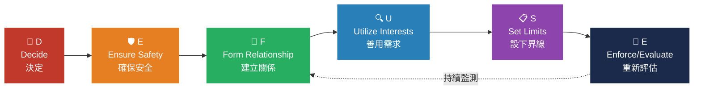
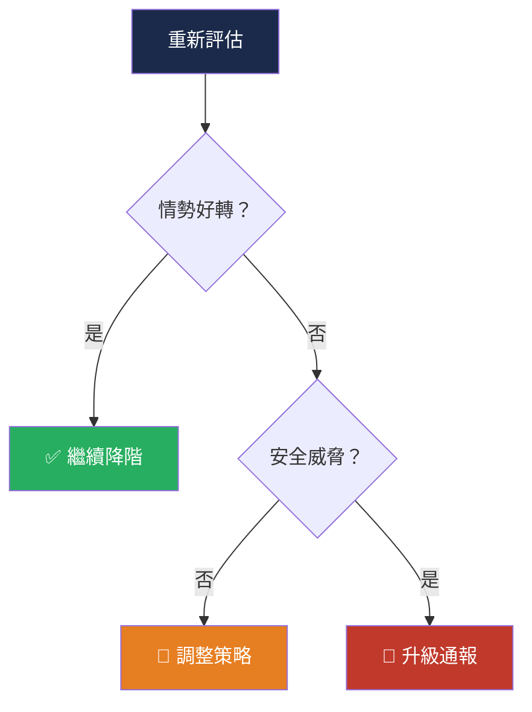
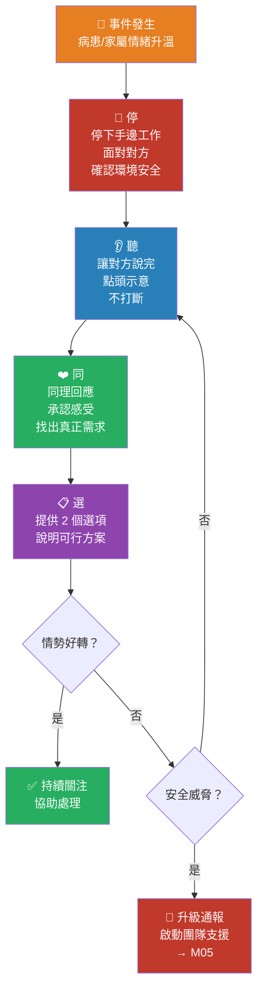

# 言語降階與 DEFUSE 框架

### M04 — CIT 門診暴力去激化工作坊

**講師：林皓陽醫師**

115 年 4 月 20 日 ｜ 09:10--10:10（60 min）

---

## 降階的本質

🎯

目標是降階，不是講道理

面對憤怒、混亂的人，講道理不是目標，**降階才是目標**。下樓梯需要時間 -- 允許關係建立的時間，不要急著「解決問題」。

**降階是反直覺的**：恐懼、緊張會傳染，但**冷靜也會**。需要練習才能在高壓下保持冷靜。

---

## 降階溝通三原則

🚫

<h3 style="margin: 8px 0;">不評斷</h3>

不對病人的情緒或行為做價值判斷

用「我理解......」 取代「你不要......」

🤝

<h3 style="margin: 8px 0;">不對抗</h3>

不與病人爭論對錯，不升高衝突

用「我們一起來看看......」 取代「這不是我的問題」

🧍

<h3 style="margin: 8px 0;">不離開</h3>

不在病人最激動時轉身離開

前提：安全無虞 有威脅時應立即退避

---

## DEFUSE 六步驟全景

**六個步驟不必然有嚴格順序**，實務中經常反覆交替使用。DEFUSE 是框架，不是食譜。

---

## D -- Decide（決定）

**核心問題：此情境是否適合口頭降階？**

| 判斷項目 | 適合降階 | 不適合降階 |
|---------|---------|----------|
| 溝通能力 | 仍在抱怨、仍願意對話 | 完全無法溝通 |
| 行為表現 | 可遵循簡單指示 | 已持物攻擊 |
| 環境安全 | 環境尚屬安全 | 已有立即傷害 |

**門診判斷要點**：病人仍在抱怨 = 有降階空間。若已持物攻擊或完全無法溝通 → 直接啟動升級通報。

---

## E -- Ensure Safety（確保安全）

::left::

### 安全檢查清單

- ✅ 確認後援充足（誰來支援？）
- ✅ 清除周邊危險物品
- ✅ 維持兩臂距離（1--2 公尺）
- ✅ 側身 45° 站位
- ✅ 靠近出口
- ✅ 不被逼至角落

::right::

### 安全行為

**接近方式**：從患者側面緩慢接近

**對話姿勢**：雙手自然放在身體前方

**避免**：正面貼近、背對出口、形成包圍

---

## F -- Form Relationship（建立關係）

### 建立連結的四步驟

🗣️ **自我介紹**：「您好，我是護理師小陳」

🙋 **詢問稱呼**：「請問怎麼稱呼您？」

💬 **簡單用詞**：短句子、日常語言、不用專業術語

🤝 **立刻選邊站**：「我們是來幫你的」「讓我們來幫你好嗎？」

**關鍵**：讓對方感受到你是**站在他那邊的人**，而不是體制的代言人。

---

## U -- Utilize Interests（善用需求）

找出對方真正要什麼

### 表面訴求 vs 真正需求

| 表面訴求 | 真正需求 |
|---------|---------|
| 「我要插隊！」 | 擔心身體不適 |
| 「叫你們主管來！」 | 覺得不被重視 |
| 「這什麼爛醫院！」 | 焦慮 + 無力感 |

**關鍵技巧**：同理 ≠ 同意

「我理解您等了很久很著急」

→ 承認的是**感受**，不是認同插隊的要求

盡可能建立共識：對事實的共識、對原則的共識、對風險的共識，甚至「對於沒有共識的共識」

---

## S -- Set Limits（設下界線）

**核心原則：提供選項，不是下命令**

| 方式 | 範例 | 效果 |
|------|------|------|
| ❌ **命令** | 「你給我坐下！」 | 對抗升高、失去合作 |
| ❌ **威脅** | 「再吵就叫駐警」 | 激化衝突、破壞關係 |
| ✅ **提供選擇** | 「您可以坐這邊等，或我先帶您量血壓？」 | 釋出善意、引導思考 |
| ✅ **說明後果** | 「如果您願意配合，我可以更快幫您處理」 | 動機連結、建立掌控感 |

**為什麼提供選擇有效？** 
提供選擇 = 釋出善意 → 引導病患思考 → 退出情緒腦 → 建立掌控感

---

## E -- Enforce / Evaluate（重新評估）

### 自我檢查

🫀 **檢查自己的脈搏** -- 你緊張了嗎？

📊 **重新評估降階效果** -- 暴力曲線位置在哪？

✅ **情勢好轉** → 持續 DEFUSE

⚠️ **情勢升溫** → 退避並啟動支援

### 決策點

---

## 停聽同選 ↔ DEFUSE 對照

| 停聽同選 | DEFUSE 對應 | 門診動作 |
|:-------:|:----------:|---------|
| **停** | D (Decide) + E (Ensure Safety) | 停下手邊工作、面對對方、確認環境安全與出口位置 |
| **聽** | F (Form Relationship) | 讓對方說完、點頭示意、稱呼姓名、自我介紹 |
| **同** | U (Utilize Interests) | 同理回應、承認感受、找出對方真正需求 |
| **選** | S (Set Limits) + E (Enforce) | 提供 2 個選項、說明可行方案、必要時升級處理 |

**記憶口訣**：停下來 → 聽他說 → 同理心 → 給選擇

---

## 常見錯誤話術

❌ 「大家都在等，你不要吵。」 
<small>問題：否定感受、命令語氣</small>

❌ 「先生你冷靜一下。」 
<small>問題：暗示對方「不正常」，通常引發反彈</small>

❌ 「你不要這麼激動。」 
<small>問題：評斷對方情緒，病人會更生氣</small>

❌ 「這不是我們的問題。」 
<small>問題：防衛姿態，切斷溝通</small>

❌ 「你再這樣就叫駐警。」 
<small>問題：威脅語氣，升級衝突</small>

**共同問題**：這些話術都是在**評斷對方**或**對抗對方**

---

## 建議話術

✅ 「我知道等候很辛苦，我來幫您確認進度。」 
<small>取代：「大家都在等，你不要吵。」</small>

✅ 「先生，您慢慢說，這樣我才能好好聽到您說的。」 
<small>取代：「先生你冷靜一下。」</small>

✅ 「我是來瞭解你的，讓我們把情緒先放下來，你好好說一遍。」 
<small>取代：「你不要這麼激動。」</small>

✅ 「我理解您的困擾，讓我看看能怎麼協助。」 
<small>取代：「這不是我們的問題。」</small>

✅ 「我想幫您處理，但我需要您跟我一起合作。」 
<small>取代：「你再這樣就叫駐警。」</small>

---

## 情境 1：等候過久

::left::

### 情境描述

病人女兒推著輪椅上的阿嬤走向護理站：

「到底還要等多久？我媽都快暈倒了！」

**風險評估**：情緒激動但未有肢體威脅，適合降階

::right::

### 建議對話流程

| 步驟 | 話術 |
|:----:|------|
| **停** | 放下手邊工作，站起面對 |
| **聽** | 「嗯......」「我聽到了......」 |
| **同** | 「等這麼久真的很辛苦，我理解您很擔心媽媽的身體。」 |
| **選** | 「您可以先讓阿嬤坐著休息，我幫您確認看診進度；或者我先帶阿嬤去量個血壓？」 |

---

## 情境 2：自費爭議

::left::

### 情境描述

病人質疑：

「為什麼這個藥要自費？上次明明健保有給付！」

**風險評估**：對制度不滿，情緒升溫中，需要及時回應

::right::

### 建議對話流程

| 步驟 | 話術 |
|:----:|------|
| **停** | 暫停手邊作業，面對病人 |
| **聽** | 「您說上次是健保給付的，我了解了。」 |
| **同** | 「突然被告知要自費，換作是我也會想弄清楚。」 |
| **選** | 「我可以幫您查上次的處方紀錄來比對；或者您等一下直接跟醫師確認？」 |

---

## 情境 3：陪病者激動

::left::

### 情境描述

家屬在候診區大聲質問：

「我爸等了兩個小時，你們到底在幹什麼！」

**風險評估**：公開場域、聲量大、可能影響其他候診者

::right::

### 建議對話流程

| 步驟 | 話術 |
|:----:|------|
| **停** | 站起、走向家屬，保持安全距離 |
| **聽** | 「您說等了兩個小時，我可以理解您的心情。」 |
| **同** | 「您是擔心爸爸的身體狀況對不對？這份心情我完全能理解。」 |
| **選** | 「我可以幫您確認前面還有幾位；或者如果爸爸不舒服，我先幫他做初步評估。」 |

---

## 影片播放引導

### 觀察重點

**注意觀察**

- 🎬 護理師的**站位**與**距離**
- 🗣️ 使用了哪些**降階話術**？
- 🤔 哪個時間點是**關鍵轉折**？
- 👀 **非語言溝通**做得如何？

**暫停討論點**

- ⏸️ 情勢開始升溫時
- ⏸️ 護理師做出關鍵回應時
- ⏸️ 出現明顯降階效果時
- ⏸️ 你覺得可以做得更好時

**討論方向**：如果是你在現場，你會怎麼做？有沒有其他選擇？

---

## 非語言溝通

降階不只是「說什麼」，更是「怎麼呈現自己」

| 面向 | ✅ 建議做法 | ❌ 避免做法 |
|------|-----------|-----------|
| **音量** | 適中，語速放緩 | 大聲回嗆、語速過快 |
| **眼神** | 維持 40--60% 接觸，視線等高 | 瞪視、完全不看對方 |
| **姿勢** | 張開手掌、重心在後、隨時可移動 | 交叉抱胸、雙手叉腰 |
| **距離** | 1--2 公尺安全距離 | 正面貼近、退至角落 |
| **動作** | 小點頭，緩慢移動 | 突發動作、指著對方 |

**小點頭，大幫忙** -- 點頭是最簡單有效的非語言降階訊號

---

## 當降階無效時

⚠️ 辨識言語降階已失效的四大徵兆

⏱️ **持續嘗試 5 分鐘仍無改善**

📈 **激動程度持續升高**

👊 **出現肢體威脅動作**

🔇 **完全無法溝通**

出現任一徵兆 → 從「一人降階」轉換為「團隊應變」 
詳見 **M05 團隊合作與安全處置**

升級處理**不是失敗**；延誤升級**才是失敗**。

---

## 門診版停聽同選完整流程

---

## 重點回顧

🎯 降階目標是**降低情緒**，不是講道理或爭輸贏

🚫 三原則：**不評斷、不對抗、不離開**（安全前提下）

🔤 **DEFUSE** 六步驟：Decide → Ensure Safety → Form Relationship → Utilize Interests → Set Limits → Enforce/Evaluate

🗣️ **停聽同選**：停下來 → 聽他說 → 同理心 → 給選擇

✅ 提供選擇 = 釋出善意 + 引導思考 + 建立掌控感

⚠️ 降階無效時，**及時升級才是專業判斷**

---
layout: center
---

## Q & A

💬

提問與討論

**歡迎分享**

您在門診遇過最難處理的衝突情境是什麼？ 
當時是如何處理的？

林皓陽醫師 ｜ CIT 門診暴力去激化工作坊

