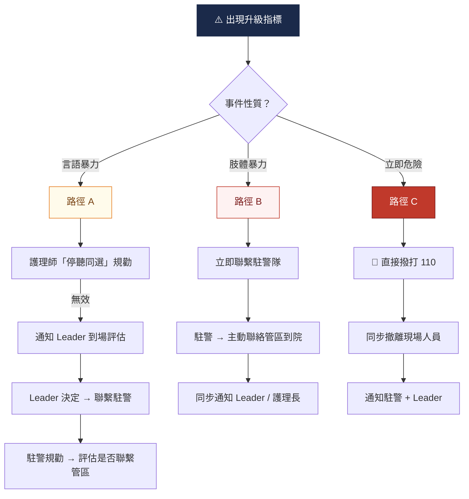
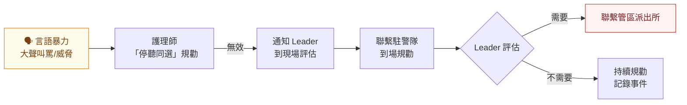
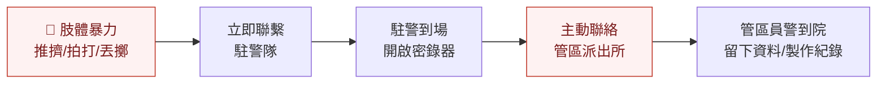
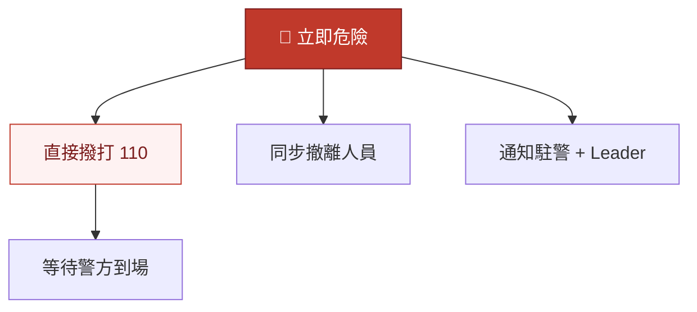

# 團隊合作與通報升級

### CIT 門診暴力去激化工作坊

<div style="margin-top: 40px; color: rgba(255,255,255,0.9); font-size: 1.1em;">
<strong>劉政亨醫師</strong> ｜ 臺大醫院教學部暨急診醫學部
</div>

<div style="margin-top: 16px; color: rgba(255,255,255,0.7); font-size: 0.9em;">
115 年 4 月 20 日 ｜ 10:20--12:00（100 min）
</div>

<style>
.slidev-layout { font-family: 'Noto Sans TC', 'PingFang TC', system-ui, sans-serif; color: #374151; }
.slidev-layout h1 { color: #1B2A4A !important; font-weight: 700; }
.slidev-layout h2 { color: #1B2A4A !important; border-left: 4px solid #1E8449; padding-left: 12px; margin-bottom: 14px; font-weight: 700; border-bottom: none !important; }
.slidev-layout h3 { color: #1E8449 !important; font-weight: 600; }
table { font-size: 0.82em; width: 100%; border-collapse: collapse; }
th { background: #1B2A4A; color: #fff; padding: 8px 12px; text-align: left; font-weight: 600; }
td { padding: 6px 12px; border-bottom: 1px solid #f1f5f9; }
tr:nth-child(even) td { background: #f8fafc; }
.alert-red { background: #fef2f2; border-left: 4px solid #C0392B; padding: 10px 14px; border-radius: 6px; color: #7B1C1C; margin: 8px 0; }
.alert-blue { background: #eff6ff; border-left: 4px solid #2980B9; padding: 10px 14px; border-radius: 6px; color: #1a5276; margin: 8px 0; }
.alert-amber { background: #fffbeb; border-left: 4px solid #E67E22; padding: 10px 14px; border-radius: 6px; color: #784212; margin: 8px 0; }
.alert-green { background: #f0fdf4; border-left: 4px solid #27AE60; padding: 10px 14px; border-radius: 6px; color: #145A32; margin: 8px 0; }
.big-text { font-size: 1.8em; font-weight: 700; text-align: center; margin: 20px 0; }
.big-emoji { font-size: 3em; text-align: center; }
</style>

---

# 一個人無法處理暴力事件

<div class="big-emoji">

🤝

</div>

<div class="big-text" style="color: #1E8449;">
暴力處置 ＝ 團隊任務
</div>

<div style="text-align: center; font-size: 1.15em; color: #6b7280; margin-top: 12px;">
單打獨鬥是最危險的處置方式<br/>
每位在場同仁快速辨識角色、各司其職
</div>

---

## 團隊三角色模型

<div style="display: grid; grid-template-columns: 1fr 1fr 1fr; gap: 16px; margin-top: 20px;">

<div style="background: linear-gradient(135deg, #f0fdf4, #dcfce7); border: 2px solid #1E8449; border-radius: 12px; padding: 20px; text-align: center;">
<div style="font-size: 2.5em;">🗣️</div>
<h3 style="margin: 8px 0 6px;">主責溝通者</h3>
<div style="font-size: 0.85em; color: #374151;">
一對一降階溝通<br/>
運用「停聽同選」/ DEFUSE<br/>
<strong>現場只有一人說話</strong>
</div>
</div>

<div style="background: linear-gradient(135deg, #eff6ff, #dbeafe); border: 2px solid #2980B9; border-radius: 12px; padding: 20px; text-align: center;">
<div style="font-size: 2.5em;">📞</div>
<h3 style="margin: 8px 0 6px; color: #2980B9 !important;">通報者</h3>
<div style="font-size: 0.85em; color: #374151;">
啟動 Call-for-Help<br/>
護理站 → Leader → 駐警<br/>
<strong>退至安全位置通報</strong>
</div>
</div>

<div style="background: linear-gradient(135deg, #fffbeb, #fef3c7); border: 2px solid #E67E22; border-radius: 12px; padding: 20px; text-align: center;">
<div style="font-size: 2.5em;">🛡️</div>
<h3 style="margin: 8px 0 6px; color: #E67E22 !important;">現場秩序維護者</h3>
<div style="font-size: 0.85em; color: #374151;">
引導其他病人遠離<br/>
清除危險物品<br/>
<strong>確保出口暢通</strong>
</div>
</div>

</div>

<div class="alert-green" style="margin-top: 16px; text-align: center;">
<strong>指定原則</strong>：第一位到場資深同仁口語指定 ——「我來跟他說，你去打電話。」
</div>

---

## 主責溝通者：誰來擔任？

<div style="display: grid; grid-template-columns: 1fr 1fr; gap: 16px; margin-top: 10px;">
<div>

| 情境 | 人選 |
|------|------|
| 病人針對特定護理師 | **另一位**同仁接手 |
| 病人對流程不滿 | **當下互動最多**的同仁 |
| 主管到場 | 主管**評估後決定** |
| 駐警到場 | 溝通仍由**護理師主導** |

</div>
<div>

<div class="alert-green">
<strong>核心原則</strong><br/>
一人溝通，其他人不插嘴<br/><br/>
多人同時說話是降階失敗最常見的原因
</div>

<div class="alert-blue" style="margin-top: 10px;">
<strong>口語指定範例</strong><br/>
「小美，你繼續跟王先生說，我去打電話。」<br/>
「學姊，這邊我來處理，麻煩帶其他病人到那邊。」
</div>

</div>
</div>

---

## 何時交接主責溝通者

<div style="display: grid; grid-template-columns: 1fr 1fr; gap: 20px; margin-top: 12px;">
<div>

### 四大交接時機

<div style="margin-top: 8px;">

<div style="background: #f0fdf4; border-radius: 8px; padding: 10px 14px; margin: 6px 0; border-left: 3px solid #1E8449;">
<strong>1.</strong> 降階嘗試 <strong>5 分鐘</strong>無改善
</div>

<div style="background: #f0fdf4; border-radius: 8px; padding: 10px 14px; margin: 6px 0; border-left: 3px solid #1E8449;">
<strong>2.</strong> 溝通者本身是<strong>衝突觸發者</strong>
</div>

<div style="background: #f0fdf4; border-radius: 8px; padding: 10px 14px; margin: 6px 0; border-left: 3px solid #1E8449;">
<strong>3.</strong> 溝通者<strong>情緒受影響</strong>（心跳加速、語氣變化）
</div>

<div style="background: #f0fdf4; border-radius: 8px; padding: 10px 14px; margin: 6px 0; border-left: 3px solid #1E8449;">
<strong>4.</strong> 對方要求「<strong>找主管來</strong>」
</div>

</div>

</div>
<div>

### 交接話術

<div class="alert-blue" style="margin-top: 8px;">
「○○，麻煩你來接手，我先去聯絡 XX。」
</div>

<div class="alert-amber" style="margin-top: 12px;">
<strong>重要心態</strong><br/><br/>
交接不是「承認失敗」<br/>
而是「<strong>團隊策略的一部分</strong>」<br/><br/>
順暢的交接本身就是一種降階技巧
</div>

</div>
</div>

---

## Call-for-Help 啟動流程

```mermaid {scale: 0.85}
flowchart LR
    A["🏥 診間同仁<br/><span style='font-size:0.8em'>情緒激動/言語衝突</span>"] -->|口頭/對講機| B["📋 護理站<br/><span style='font-size:0.8em'>第一層通知</span>"]
    B -->|分機電話| C["👩‍⚕️ 當班 Leader<br/><span style='font-size:0.8em'>規勸無效時</span>"]
    C -->|分機電話| D["👮 駐警隊<br/><span style='font-size:0.8em'>言語威脅/肢體</span>"]
    D -->|駐警聯繫| E["🚔 管區派出所<br/><span style='font-size:0.8em'>肢體暴力</span>"]
    E -->|立即危險| F["🚨 110<br/><span style='font-size:0.8em'>持凶器/生命威脅</span>"]

    style A fill:#f0fdf4,stroke:#1E8449,color:#145A32
    style B fill:#f0fdf4,stroke:#1E8449,color:#145A32
    style C fill:#eff6ff,stroke:#2980B9,color:#1a5276
    style D fill:#fffbeb,stroke:#E67E22,color:#784212
    style E fill:#fef2f2,stroke:#C0392B,color:#7B1C1C
    style F fill:#C0392B,stroke:#7B1C1C,color:#fff
```



<div class="alert-amber" style="margin-top: 8px;">
<strong>由近到遠</strong>：診間 → 護理站 → Leader → 駐警 → 管區 → 110 ｜ 每一層都是升級的判斷節點
</div>

---

## 安全站位：團隊版

<div style="display: grid; grid-template-columns: 1.2fr 1fr; gap: 20px; margin-top: 10px;">
<div>

```
              ┌─────────┐
              │  出 口   │
              └────┬────┘
                   │
          🛡️ 秩序維護者
          ├── 管理其他病人動線
          ├── 清除危險物品
                   │
    🗣️ 主責溝通者 ◄──► 😡 病人
       (1-2m, 側身45°)
                   │
          📞 通報者
          └── 退至護理站通報
```

</div>
<div>

### 站位要點

<div style="background: #f0fdf4; border-radius: 8px; padding: 10px; margin: 6px 0;">
保持 <strong>1-2 公尺</strong>安全距離
</div>

<div style="background: #f0fdf4; border-radius: 8px; padding: 10px; margin: 6px 0;">
側身約 <strong>45 度</strong>面對病人
</div>

<div style="background: #f0fdf4; border-radius: 8px; padding: 10px; margin: 6px 0;">
靠近出口，確保<strong>退路暢通</strong>
</div>

<div class="alert-red" style="margin-top: 10px;">
<strong>絕對不要圍堵病人</strong><br/>
圍堵會讓病人感到被困，升高攻擊風險
</div>

</div>
</div>

---

## 密錄器使用時機

<div style="display: grid; grid-template-columns: 1fr 1fr; gap: 16px; margin-top: 10px;">
<div>

### 何時開始錄影

<div style="background: #f0fdf4; border-radius: 8px; padding: 12px; margin: 8px 0; border-left: 3px solid #1E8449;">
出現<strong>任一升級指標</strong>時即應開始
</div>

- 言語威脅
- 持物揮舞
- 逼近醫護
- 無法溝通

### 告知話術

<div class="alert-blue">
「為了保障雙方權益，我們會進行錄影。」
</div>

</div>
<div>

### 注意事項

<div class="alert-amber">
<strong>錄影是證據保全，不是挑釁</strong><br/>
不要用錄影行為刺激對方
</div>

<div style="margin-top: 12px;">

| 項目 | 說明 |
|------|------|
| 拍攝 | 穩定、涵蓋全景 |
| 保管 | Leader 統一保管 |
| 禁止 | 外流或上傳社群 |

</div>

### 無密錄器替代方案

- 手機錄音（至少音訊）
- 確認監視器覆蓋範圍
- 事後立即書面記錄

</div>
</div>

---

## 駐警到場：SBAR 簡報

<div style="margin-top: 8px;">

| SBAR | 中文意涵 | 簡報內容 | 範例 |
|:----:|---------|---------|------|
| **S** | Situation | 事件類型與當前狀態 | 「這位先生情緒激動」 |
| **B** | Background | 導致衝突的原因 | 「因為等候時間過長」 |
| **A** | Assessment | 目前情緒與行為 | 「有言語威脅但無肢體動作」 |
| **R** | Recommendation | 需要什麼協助 | 「請協助維持現場秩序」 |

</div>

<div class="alert-green" style="margin-top: 10px;">
<strong>完整範例</strong>：「這位先生因為等候時間過長情緒激動（S+B），目前有言語威脅但沒有肢體動作（A），請協助維持現場秩序（R）。」
</div>

<div style="display: grid; grid-template-columns: 1fr 1fr 1fr; gap: 10px; margin-top: 10px;">
<div style="background: #f0fdf4; border-radius: 8px; padding: 8px 12px; text-align: center;">
控制在 <strong>30 秒</strong>以內
</div>
<div style="background: #eff6ff; border-radius: 8px; padding: 8px 12px; text-align: center;">
先講<strong>結論</strong>再補背景
</div>
<div style="background: #fffbeb; border-radius: 8px; padding: 8px 12px; text-align: center;">
明確說出<strong>需要什麼</strong>
</div>
</div>

---

## 升級條件四指標

<div class="alert-red" style="text-align: center; margin-bottom: 12px;">
<strong>任何一項出現 → 立即啟動通報流程 ｜ 寧可過度通報，不可延誤處置</strong>
</div>

<div style="display: grid; grid-template-columns: 1fr 1fr; gap: 14px;">

<div style="background: linear-gradient(135deg, #fef2f2, #fecaca); border: 2px solid #C0392B; border-radius: 12px; padding: 16px; text-align: center;">
<div style="font-size: 2.2em;">🗯️</div>
<h3 style="color: #C0392B !important; margin: 6px 0;">言語威脅</h3>
<div style="font-size: 0.85em;">「我要打你」「信不信我砸了這裡」<br/>「你給我小心」</div>
</div>

<div style="background: linear-gradient(135deg, #fef2f2, #fecaca); border: 2px solid #C0392B; border-radius: 12px; padding: 16px; text-align: center;">
<div style="font-size: 2.2em;">🪑</div>
<h3 style="color: #C0392B !important; margin: 6px 0;">持物品揮舞</h3>
<div style="font-size: 0.85em;">椅子、點滴架、水壺<br/>雨傘等物品</div>
</div>

<div style="background: linear-gradient(135deg, #fef2f2, #fecaca); border: 2px solid #C0392B; border-radius: 12px; padding: 16px; text-align: center;">
<div style="font-size: 2.2em;">🚶‍♂️</div>
<h3 style="color: #C0392B !important; margin: 6px 0;">逼近醫護人員</h3>
<div style="font-size: 0.85em;">跨越安全距離 (&lt; 1m)<br/>步步進逼、堵住出口</div>
</div>

<div style="background: linear-gradient(135deg, #fef2f2, #fecaca); border: 2px solid #C0392B; border-radius: 12px; padding: 16px; text-align: center;">
<div style="font-size: 2.2em;">🚫</div>
<h3 style="color: #C0392B !important; margin: 6px 0;">無法溝通</h3>
<div style="font-size: 0.85em;">完全不回應、持續吼叫<br/>疑似酒醉或精神狀態異常</div>
</div>

</div>

---

## 通報決策樹



---

## 路徑 A：言語暴力

<div style="margin-top: 10px;">



</div>

<div class="alert-amber" style="margin-top: 12px;">
<strong>重點</strong>：言語暴力階段，駐警到場後先以<strong>規勸</strong>方式處理。由當班 Leader 到現場評估後，再告知駐警是否需聯繫管區。
</div>

<div class="alert-blue" style="margin-top: 8px;">
<strong>通報話術</strong>：「這裡是 XX 科診間，有一位病人情緒激動，目前有言語威脅，請駐警前來支援。地點在 X 樓 X 診。」
</div>

---

## 路徑 B：肢體暴力

<div style="margin-top: 10px;">



</div>

<div class="alert-red" style="margin-top: 12px;">
<strong>肢體暴力 = 駐警立即主動聯絡管區</strong><br/>不需等待 Leader 評估，直接啟動警方介入
</div>

<div class="alert-amber" style="margin-top: 8px;">
<strong>特別注意</strong>：若現場管區員警欲請當事人私下了事，<strong>務必告知 Leader 及護理長</strong>，不可自行接受私了。
</div>

---

## 路徑 C：立即危險

<div class="big-text" style="color: #C0392B; margin: 30px 0;">
🚨 直接撥打 110
</div>

<div style="display: grid; grid-template-columns: 1fr 1fr; gap: 16px;">

<div class="alert-red">
<strong>哪些情境可直接報警？</strong><br/><br/>
- 持刀、持棍棒等凶器<br/>
- 已造成人員受傷<br/>
- 挾持人質或封鎖出入口<br/>
- 恐嚇炸彈或縱火
</div>

<div>



</div>
</div>

<div class="alert-amber" style="margin-top: 12px; text-align: center;">
<strong>人身安全最優先</strong> ── 先撤離，再通報，不要英雄主義
</div>

---

## 事件後處理清單

<div style="margin-top: 10px;">

| 順序 | 項目 | 時機 | 負責人 | 重點 |
|:----:|------|------|--------|------|
| 1 | **衛生局滋擾通報** | 事件後儘速 | Leader / 護理長 | 逐項確認通報單內容 |
| 2 | **院內異常事件通報** | 24 小時內 | Leader / 指定同仁 | 經過、處置、傷害、建議 |
| 3 | **病歷紀錄** | 當日 | 主治/護理師 | 客觀描述，避免主觀用語 |
| 4 | **監視畫面保存** | 立即 | 相關單位 | 密錄器檔案由 Leader 保管 |

</div>

<div class="alert-green" style="margin-top: 12px;">
<strong>快速口訣</strong>：<strong>通</strong>報衛生局 → <strong>報</strong>院內異常 → <strong>記</strong>病歷 → <strong>存</strong>畫面 ＝ 「通報記存」
</div>

<div class="alert-red" style="margin-top: 8px;">
<strong>證據保存很重要</strong>：密錄器/手機錄影檔案統一交由 Leader 保管，<strong>不得外流或上傳社群媒體</strong>
</div>

---

## 人員關懷時間軸

<div style="display: grid; grid-template-columns: 1fr 1fr; gap: 20px; margin-top: 12px;">
<div>

### 即時關懷 (0-24h)

<div style="background: linear-gradient(135deg, #fef2f2, #fecaca); border-radius: 10px; padding: 14px; margin: 8px 0;">
<strong>事件當日</strong><br/>
- 確認身心狀況<br/>
- 協助就醫及驗傷<br/>
- 負責人：Leader / 護理長
</div>

<div style="background: linear-gradient(135deg, #fffbeb, #fef3c7); border-radius: 10px; padding: 14px; margin: 8px 0;">
<strong>事件後 1-3 日</strong><br/>
- 主動關懷<br/>
- 詢問是否需要調整班次<br/>
- 負責人：護理長
</div>

</div>
<div>

### 後續追蹤 (1 week - 1 month)

<div style="background: linear-gradient(135deg, #eff6ff, #dbeafe); border-radius: 10px; padding: 14px; margin: 8px 0;">
<strong>事件後 1-2 週</strong><br/>
- 追蹤心理狀態<br/>
- 評估是否需轉介心理諮詢<br/>
- 負責人：護理長 / 職安室
</div>

<div style="background: linear-gradient(135deg, #f0fdf4, #dcfce7); border-radius: 10px; padding: 14px; margin: 8px 0;">
<strong>事件後 1 個月</strong><br/>
- 團隊檢討會議 (debrief)<br/>
- 回顧處置流程<br/>
- 負責人：單位主管
</div>

</div>
</div>

---

## 心理支持資源

<div style="display: grid; grid-template-columns: 1fr 1fr 1fr; gap: 16px; margin-top: 20px;">

<div style="background: linear-gradient(135deg, #eff6ff, #dbeafe); border: 2px solid #2980B9; border-radius: 12px; padding: 20px; text-align: center;">
<div style="font-size: 2.5em;">🏥</div>
<h3 style="color: #2980B9 !important; margin: 8px 0;">院內心理諮詢</h3>
<div style="font-size: 0.88em;">
員工心理諮商服務<br/>
可透過院內系統申請<br/>
<strong>完全保密</strong>
</div>
</div>

<div style="background: linear-gradient(135deg, #f0fdf4, #dcfce7); border: 2px solid #1E8449; border-radius: 12px; padding: 20px; text-align: center;">
<div style="font-size: 2.5em;">💚</div>
<h3 style="margin: 8px 0;">衛生局安心服務</h3>
<div style="font-size: 0.88em;">
衛生局復原關懷服務<br/>
由院方協助轉介<br/>
<strong>免費使用</strong>
</div>
</div>

<div style="background: linear-gradient(135deg, #fffbeb, #fef3c7); border: 2px solid #E67E22; border-radius: 12px; padding: 20px; text-align: center;">
<div style="font-size: 2.5em;">🤗</div>
<h3 style="color: #E67E22 !important; margin: 8px 0;">同仁陪伴</h3>
<div style="font-size: 0.88em;">
員工關懷計畫<br/>
主管與同事支持<br/>
<strong>你不是一個人</strong>
</div>
</div>

</div>

<div class="alert-green" style="margin-top: 16px; text-align: center;">
經歷暴力事件後出現失眠、焦慮、反覆回想是<strong>正常反應</strong>。<br/>
主動尋求支持是<strong>專業的表現</strong>，不需要「撐過去」。
</div>

---

## 筆錄流程

<div style="display: grid; grid-template-columns: 1fr 1fr; gap: 20px; margin-top: 16px;">
<div>

<div class="alert-blue">
<strong>地點</strong> 📍<br/>
可請管區在<strong>門診</strong>製作筆錄，不一定要去警局
</div>

<div class="alert-blue" style="margin-top: 10px;">
<strong>時間</strong> 🕐<br/>
若上班中不便，可與管區<strong>另約時間</strong>至警局
</div>

</div>
<div>

<div class="alert-blue">
<strong>陪同</strong> 👮<br/>
若自行前往感到害怕，可請<strong>本院駐警陪同</strong>
</div>

<div class="alert-blue" style="margin-top: 10px;">
<strong>工時</strong> ⏱️<br/>
至警局做筆錄之時間<strong>可予加時數</strong>，不需使用個人假別
</div>

</div>
</div>

<div class="alert-green" style="margin-top: 16px; text-align: center; font-size: 1.05em;">
<strong>做筆錄是維護自身權益的重要步驟，院方會全力支持同仁</strong>
</div>

---
layout: center
---

<div class="big-emoji">

📹

</div>

<div class="big-text" style="color: #1B2A4A;">
案例分析與綜合討論
</div>

<div style="text-align: center; font-size: 1.1em; color: #6b7280; margin-top: 12px;">
11:20 - 11:50 ｜ 30 分鐘
</div>

---

## 前測錄影回放引導

<div style="display: grid; grid-template-columns: 1fr 1fr; gap: 20px; margin-top: 12px;">
<div>

### 觀察重點

<div style="background: #f0fdf4; border-radius: 8px; padding: 10px 14px; margin: 6px 0; border-left: 3px solid #1E8449;">
<strong>1. 團隊分工</strong><br/>誰在溝通？誰在通報？
</div>

<div style="background: #eff6ff; border-radius: 8px; padding: 10px 14px; margin: 6px 0; border-left: 3px solid #2980B9;">
<strong>2. 站位安全</strong><br/>距離是否足夠？出口暢通嗎？
</div>

<div style="background: #fffbeb; border-radius: 8px; padding: 10px 14px; margin: 6px 0; border-left: 3px solid #E67E22;">
<strong>3. 溝通技巧</strong><br/>用了哪些降階技巧？
</div>

<div style="background: #fef2f2; border-radius: 8px; padding: 10px 14px; margin: 6px 0; border-left: 3px solid #C0392B;">
<strong>4. 升級判斷</strong><br/>何時應該通報？是否延誤？
</div>

</div>
<div>

### Debrief 原則

<div class="alert-green">
<strong>安全空間</strong><br/>
- 不批判、不追究個人<br/>
- 重點在流程改善<br/>
- 每個人都是學習者
</div>

<div class="alert-amber" style="margin-top: 10px;">
<strong>回放時注意</strong><br/>
- 暫停關鍵時刻討論<br/>
- 觀察非語言訊號<br/>
- 記錄可改善的環節
</div>

</div>
</div>

---

## Debrief 三問框架

<div style="display: grid; grid-template-columns: 1fr 1fr 1fr; gap: 16px; margin-top: 24px;">

<div style="background: linear-gradient(135deg, #eff6ff, #dbeafe); border: 2px solid #2980B9; border-radius: 12px; padding: 24px; text-align: center;">
<div style="font-size: 2.5em;">1</div>
<h3 style="color: #2980B9 !important; margin: 10px 0;">發生了什麼？</h3>
<div style="font-size: 0.9em; color: #374151;">
What happened?<br/><br/>
客觀描述事件經過<br/>
不加入判斷或情緒
</div>
</div>

<div style="background: linear-gradient(135deg, #f0fdf4, #dcfce7); border: 2px solid #1E8449; border-radius: 12px; padding: 24px; text-align: center;">
<div style="font-size: 2.5em;">2</div>
<h3 style="margin: 10px 0;">哪些做得好？</h3>
<div style="font-size: 0.9em; color: #374151;">
What worked?<br/><br/>
肯定團隊的正確行動<br/>
強化好的行為模式
</div>
</div>

<div style="background: linear-gradient(135deg, #fffbeb, #fef3c7); border: 2px solid #E67E22; border-radius: 12px; padding: 24px; text-align: center;">
<div style="font-size: 2.5em;">3</div>
<h3 style="color: #E67E22 !important; margin: 10px 0;">下次會怎麼做？</h3>
<div style="font-size: 0.9em; color: #374151;">
What would you change?<br/><br/>
聚焦可改善的行動<br/>
而非「做錯了什麼」
</div>
</div>

</div>

<div class="alert-green" style="margin-top: 20px; text-align: center;">
Debrief 不是檢討會，是<strong>團隊學習</strong>的最佳時刻
</div>

---

## 暴力曲線 x 技巧 Debrief

<div style="margin-top: 8px;">

| 影片時刻 | 暴力曲線階段 | 對應模組 | 關鍵技巧 |
|---------|------------|---------|---------|
| 病人開始抱怨 | 觸發期 | M01 暴力曲線 | 早期辨識警訊 |
| 情緒逐漸升高 | 升級期 | M02 自我調節 | 覺察自身情緒、深呼吸 |
| 言語攻擊出現 | 高峰前期 | M04 言語降階 | 停聽同選 / DEFUSE |
| 團隊介入 | 危機期 | M05 團隊合作 | 三角色分工、SBAR |
| 通報升級 | 危機期 | M06 通報升級 | 決策樹、四指標判斷 |
| 事件平息 | 恢復期 | M05+M06 | 事後處理、人員關懷 |

</div>

<div class="alert-blue" style="margin-top: 10px;">
<strong>對照你的錄影</strong>：在每個階段，你和團隊做了什麼？哪個環節可以更早介入？
</div>

---
layout: center
---

<div class="big-emoji">

📝

</div>

<div class="big-text" style="color: #1B2A4A;">
課程總結
</div>

<div style="text-align: center; font-size: 1.1em; color: #6b7280; margin-top: 12px;">
11:50 - 12:00 ｜ 10 分鐘
</div>

---

## 四大重點回顧

<div style="display: grid; grid-template-columns: 1fr 1fr; gap: 16px; margin-top: 16px;">

<div style="background: linear-gradient(135deg, #eff6ff, #dbeafe); border: 2px solid #2980B9; border-radius: 12px; padding: 18px;">
<div style="font-size: 1.8em; text-align: center;">📈</div>
<h3 style="color: #2980B9 !important; text-align: center;">暴力曲線</h3>
<div style="font-size: 0.88em; text-align: center;">
辨識風險 → 預判升級<br/>
<strong>早期介入是關鍵</strong>
</div>
</div>

<div style="background: linear-gradient(135deg, #f0fdf4, #dcfce7); border: 2px solid #1E8449; border-radius: 12px; padding: 18px;">
<div style="font-size: 1.8em; text-align: center;">🧘</div>
<h3 style="text-align: center;">言語降階</h3>
<div style="font-size: 0.88em; text-align: center;">
停聽同選 / DEFUSE<br/>
<strong>先連結、再引導</strong>
</div>
</div>

<div style="background: linear-gradient(135deg, #fffbeb, #fef3c7); border: 2px solid #E67E22; border-radius: 12px; padding: 18px;">
<div style="font-size: 1.8em; text-align: center;">🤝</div>
<h3 style="color: #E67E22 !important; text-align: center;">團隊合作</h3>
<div style="font-size: 0.88em; text-align: center;">
三角色分工 + 安全站位<br/>
<strong>一人溝通、團隊支援</strong>
</div>
</div>

<div style="background: linear-gradient(135deg, #fef2f2, #fecaca); border: 2px solid #C0392B; border-radius: 12px; padding: 18px;">
<div style="font-size: 1.8em; text-align: center;">📋</div>
<h3 style="color: #C0392B !important; text-align: center;">通報升級</h3>
<div style="font-size: 0.88em; text-align: center;">
四指標 → 決策樹 → 事後處理<br/>
<strong>寧可多報，不可少報</strong>
</div>
</div>

</div>

<div class="alert-green" style="margin-top: 16px; text-align: center; font-size: 1.05em;">
<strong>記住</strong>：暴力處置不是一個人的事 —— 團隊協作 + 系統支持 = 安全的工作環境
</div>

---

## 後測預告

<div style="display: grid; grid-template-columns: 1fr 1fr; gap: 20px; margin-top: 20px;">
<div>

<div style="background: linear-gradient(135deg, #f0fdf4, #dcfce7); border: 2px solid #1E8449; border-radius: 14px; padding: 24px; text-align: center;">
<div style="font-size: 2em;">📆</div>
<h3 style="margin: 10px 0;">後測日期</h3>
<div style="font-size: 1.2em; font-weight: 700; color: #1E8449;">
6/4 或 6/11（暫定）
</div>
<div style="font-size: 0.9em; color: #6b7280; margin-top: 6px;">
確切日期另行通知
</div>
</div>

</div>
<div>

### 後測內容

<div style="background: #eff6ff; border-radius: 8px; padding: 10px 14px; margin: 8px 0; border-left: 3px solid #2980B9;">
<strong>情境模擬</strong>：再次演練門診暴力情境
</div>

<div style="background: #eff6ff; border-radius: 8px; padding: 10px 14px; margin: 8px 0; border-left: 3px solid #2980B9;">
<strong>團隊評核</strong>：觀察三角色分工是否落實
</div>

<div style="background: #eff6ff; border-radius: 8px; padding: 10px 14px; margin: 8px 0; border-left: 3px solid #2980B9;">
<strong>自我檢核</strong>：對照前測錄影，看到自己的進步
</div>

<div class="alert-green" style="margin-top: 12px;">
後測目的是<strong>學習驗收</strong>，不是考試 —— 看見進步，找到方向
</div>

</div>
</div>

---
layout: center
---

<div style="text-align: center;">

<div style="font-size: 3em; margin-bottom: 16px;">🙏</div>

<h1 style="font-size: 2.2em; color: #1B2A4A !important; margin-bottom: 12px;">感謝參與</h1>

<div style="font-size: 1.2em; color: #1E8449; font-weight: 600; margin-bottom: 24px;">
CIT 門診暴力去激化工作坊
</div>

<div style="background: #f8fafc; border: 2px solid #e2e8f0; border-radius: 12px; padding: 20px; display: inline-block; margin: 16px 0;">
<div style="font-size: 0.9em; color: #6b7280; margin-bottom: 8px;">課程回饋 QR Code</div>
<div style="width: 120px; height: 120px; background: #e2e8f0; border-radius: 8px; margin: 0 auto; display: flex; align-items: center; justify-content: center; color: #94a3b8; font-size: 0.8em;">
[ QR Code ]
</div>
</div>

<div style="margin-top: 20px; font-size: 0.95em; color: #6b7280;">
<strong>劉政亨醫師</strong><br/>
臺大醫院教學部暨急診醫學部<br/>
</div>

</div>
