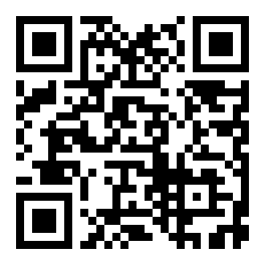

  
  
掃描分享 cit.henry780930.com

# 門診現場應變實務

### M07 — 降階兵法 × 持械 × 法律保障

**講師：林皓陽醫師**

115 年 4 月 20 日 ｜ 09:45--10:45（納入第二段課程）

---

## 降階兵法：《孫子兵法·謀攻篇》

上兵伐謀，其次伐交，其次伐兵，其下攻城

| 層級 | 策略 | 門診對應 | 成本 |
|:----:|-----|---------|:----:|
| **上策** 伐謀 | 用謀略鼓勵就醫 | 流程透明、列管個案識別、預防性介入 | 🟢 最低 |
| **次策** 伐交 | 同理傾聽降溫 | 言語降階（停聽同選、五步驟） | 🟡 低 |
| **下策** 伐兵 | 動用強制力 | 盤點團隊、裝備、駐警；約束前 checklist | 🟠 中高 |
| **最下** 攻城 | 進入患者私領域 | 強制處置：近身約束、護送就醫 | 🔴 最高 |

**核心推論**：越上層，成本越低、效果越好。一件事能靠流程透明解決，就不要讓它變成降階情境。

---

## 伐兵／攻城前 checklist

🔴 動用強制力前，逐項確認：

- [ ] **人員是否足夠？**（安全壓制需要 **5 個人**）
- [ ] **裝備是否到位？**（約束帶、手套、密錄器）
- [ ] **法律依據是否充足？**（精神衛生法第 48 條）
- [ ] **已告知團隊計畫？**（誰壓哪個肢體、誰錄影、誰通報）
- [ ] **已疏散周邊？**（避免混亂、避免他人干預）
- [ ] **已通知駐警／110 到場？**

**安全 = 事先計畫 + 大家一起**。警察有壓制專業、消防有救護專業、衛生有醫療專業 — 不是任何人可以一個人完成。

---

## 持械情境：五不原則

<strong>1️⃣ 不直接制止</strong> 
不伸手推、擋、攔

<strong>2️⃣ 不抓手或手腕</strong> 
徒手介入常導致扭打

<strong>3️⃣ 不搶奪物品</strong> 
搶奪瞬間是最危險的時刻

<strong>4️⃣ 不激怒對方</strong> 
避免命令式語氣、不指責

<strong>5️⃣ 不單獨處理</strong> 
等待支援再行動 — <strong>寧可讓病人暫時持械</strong>

**正確作法**：緩步後退至門邊、保持 2 公尺距離、平穩語氣「東西可以放旁邊」、同仁啟動暗語通報。

---

## 法律附錄：精神衛生法第 48 條

對**疑似罹患精神疾病**之人，**有傷害他人或自己，或有傷害之虞**者，應通知**衛生局心理健康科**，並視需要通知**警察機關**；護送前往就近適當醫院。

| 前提條件 | 應採行動 |
|---------|---------|
| 有傷害他人或自己 / **有傷害之虞** | **應通知衛生局心理健康科** |
| **且／或** | 可通知警察機關 |
| 罹患精神疾病之人（含物質使用障礙） | 護送前往就近適當醫院 |
| **或** 思考、情緒、知覺、認知、行為等精神狀態表現異常 | — |

**法院判決（高雄地院 104 年度）**：「只要依客觀上所發生事實，有使他人可認為患者可疑為罹有精神疾病而有送醫檢查之必要，**即難認通報送醫者有何違法之故意**」

---

## 嘉義鐵路警察案（2019）

某日早晨，派出所接獲報案：男子稱朋友與女兒要聯合謀害他。**家屬請求強制送醫**：「爸爸不吃藥也不看醫生」。

**員警因擔心被告妨害自由，未執行強制送醫。**

當晚該男子於嘉義火車站**刺死鐵路警察李承翰**，後鑑定為思覺失調症發作。

「怕被告」的恐懼，讓一線人員錯失保護自己、他人、病人本人的機會。

**結論**：法律站在「合理懷疑送醫」這邊。**送醫通常都不會錯**。

---

## 模糊情境的第一通電話

📞 (049) 255-1010

**衛福部 24 小時精神醫療緊急處置線上諮詢專線**

⚖️

<strong>判讀 48 條適用</strong> 
有衛生系統人員協助判斷

📝

<strong>保護通報者</strong> 
建立諮詢紀錄

📱

<strong>三方通話</strong> 
可接 110 或駐警

---

## TAKE HOME MESSAGE

1️⃣ <strong>降階兵法：伐謀 → 伐交 → 伐兵 → 攻城。越上層越好。</strong>

2️⃣ <strong>持械五不：不制止、不抓手、不搶奪、不激怒、不單獨。</strong>

3️⃣ <strong>安全壓制需要 5 個人。不是口號。</strong>

4️⃣ <strong>精神衛生法 48 條保護合理懷疑送醫者 — 「送醫通常都不會錯」。</strong>

5️⃣ <strong>模糊情境的第一通電話：(049) 255-1010。</strong>

6️⃣ <strong>填出勤／護理紀錄要詳實 — 用 14 項評估表的客觀語言。</strong>

更多詞條與框架速查 → <strong>cit.henry780930.com/glossary</strong>

